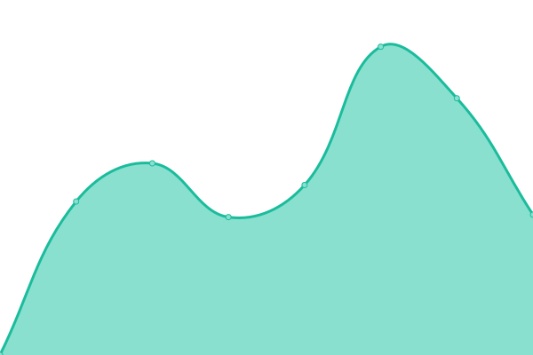
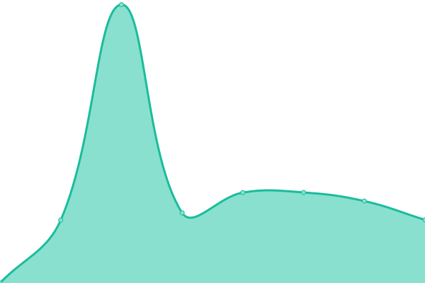
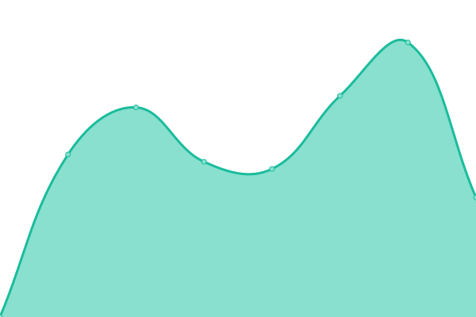

# [📈 Live Status](https://demo.upptime.js.org): <!--live status--> **🟧 Partial outage**

This repository contains the open-source uptime monitor and status page for [Alessio Rizzolo](https://twitter.com/rizzolessio), powered by [Upptime](https://github.com/upptime/upptime).

With [Upptime](https://upptime.js.org), you can get your own unlimited and free uptime monitor and status page, powered entirely by a GitHub repository. We use [Issues](https://github.com/rizzolessio/upptime-eusa/issues) as incident reports, [Actions](https://github.com/rizzolessio/upptime-eusa/actions) as uptime monitors, and [Pages](https://demo.upptime.js.org) for the status page.

<!--start: status pages-->
<!-- This summary is generated by Upptime (https://github.com/upptime/upptime) -->
<!-- Do not edit this manually, your changes will be overwritten -->
<!-- prettier-ignore -->
| URL | Status | History | Response Time | Uptime |
| --- | ------ | ------- | ------------- | ------ |
|  [European Startup Association](https://eustartupassociation.com) | 🟩 Up | [european-startup-association.yml](https://github.com/rizzolessio/upptime-eusa/commits/master/history/european-startup-association.yml) | 

 1271ms
     
 | 

<a href="https://demo.upptime.js.org/history/european-startup-association">100.00%</a>
    

|  [AFGE](https://afge.legal) | 🟩 Up | [afge.yml](https://github.com/rizzolessio/upptime-eusa/commits/master/history/afge.yml) | 

 2994ms
     
 | 

<a href="https://demo.upptime.js.org/history/afge">100.00%</a>
    

|  [Sanicode](https://sanicode.app) | 🟩 Up | [sanicode.yml](https://github.com/rizzolessio/upptime-eusa/commits/master/history/sanicode.yml) | 

 1484ms
     
 | 

<a href="https://demo.upptime.js.org/history/sanicode">100.00%</a>
    

|  [TherAbility](https://therability.toys/en) | 🟩 Up | [ther-ability.yml](https://github.com/rizzolessio/upptime-eusa/commits/master/history/ther-ability.yml) | 

 2031ms
     
 | 

<a href="https://demo.upptime.js.org/history/ther-ability">100.00%</a>
    

|  [BEF Biosystems](https://bef.bio) | 🟩 Up | [bef-biosystems.yml](https://github.com/rizzolessio/upptime-eusa/commits/master/history/bef-biosystems.yml) | 

 1443ms
     
 | 

<a href="https://demo.upptime.js.org/history/bef-biosystems">100.00%</a>
    

|  Secret Site | 🟥 Down | [secret-site.yml](https://github.com/rizzolessio/upptime-eusa/commits/master/history/secret-site.yml) | 

 0ms
     
 | 

<a href="https://demo.upptime.js.org/history/secret-site">100.00%</a>
    

<!--end: status pages-->

[**Visit our status website →**](https://demo.upptime.js.org)

## 📄 License

- Powered by: [Upptime](https://github.com/upptime/upptime)
- Code: [MIT](./LICENSE) © [Alessio Rizzolo](https://twitter.com/rizzolessio)
- Data in the `./history` directory: [Open Database License](https://opendatacommons.org/licenses/odbl/1-0/)
